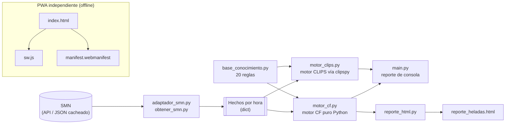

# Vela — App móvil de alerta de heladas (PWA)


## Resumen

**Vela** es un sistema experto de alerta temprana de heladas radiativas
para huertos de manzana en la Sierra Norte de Puebla. A partir de datos
meteorológicos (temperatura, humedad, viento, nubosidad, punto de rocío)
evalúa 20 reglas con factores de certeza estilo MYCIN y clasifica el
riesgo de helada hora por hora. El proyecto tiene dos caras: una **PWA**
(`index.html`) que corre 100 % en el navegador sin conexión, y una
**versión de escritorio en Python** (`main.py`) con dos motores de
inferencia intercambiables (uno propio y uno sobre CLIPS) que sirven de
validación cruzada entre sí.

## Tabla de contenido

- [Resumen](#resumen)
- [Qué incluye](#qué-incluye)
- [Dos formas de usarla](#dos-formas-de-usarla)
  - [1. Rápida (para probar y para la demo)](#1-rápida-para-probar-y-para-la-demo)
  - [2. Como app instalable en el celular (PWA real)](#2-como-app-instalable-en-el-celular-pwa-real)
- [Nota honesta sobre jalar datos del SMN en vivo](#nota-honesta-sobre-jalar-datos-del-smn-en-vivo)
- [Relación con la versión de escritorio](#relación-con-la-versión-de-escritorio)
- [Versión de escritorio (Python) — `main.py`](#versión-de-escritorio-python--mainpy)
  - [Archivos](#archivos)
  - [Instalación](#instalación)
  - [Uso](#uso)
  - [Las 20 reglas de la base de conocimiento](#las-20-reglas-de-la-base-de-conocimiento)
- [Arquitectura](#arquitectura)
- [Licencia](#licencia)

Versión móvil del sistema experto, como **PWA** (Progressive Web App):
un solo `index.html` autocontenido con toda la lógica de factores de
certeza en JavaScript. No usa librerías, ni CDN, ni servidor: funciona
sin conexión.

## Qué incluye

- **index.html** — la app completa (lógica + interfaz)
- **manifest.webmanifest** — para instalarla en la pantalla de inicio
- **sw.js** — service worker (cacheo offline cuando está alojada)
- **icon-192.png / icon-512.png** — íconos de la app
- **icono.svg** — fuente vectorial del ícono

## Dos formas de usarla

### 1. Rápida (para probar y para la demo)

Abre `index.html` con doble clic o arrástralo a una pestaña del navegador.
Funciona igual en la computadora y en el celular. Toda la lógica corre en
el dispositivo, así que **no necesita internet**.

Tiene dos pestañas:

- **Ahora** — mueve los deslizadores (temperatura, humedad, viento,
  nubosidad, hora) y el orbe de riesgo se actualiza en vivo, con el punto
  de rocío derivado y las reglas que se dispararon.
- **La noche** — carga la noche de ejemplo o pega un JSON horario del SMN
  para ver la evolución del riesgo hora por hora y el dictamen del pico.

### 2. Como app instalable en el celular (PWA real)

Para que se instale en la pantalla de inicio y quede 100 % offline con
service worker, hay que servirla por HTTPS. La vía gratis más simple es
**GitHub Pages** (ya tienes cuenta de GitHub):

1. Sube esta carpeta `app_movil` a un repositorio.
2. En *Settings → Pages*, publica la rama `main`, carpeta raíz.
3. Abre la URL `https://<usuario>.github.io/<repo>/` en el celular.
4. En el menú del navegador: **"Agregar a pantalla de inicio"**.

Queda como una app con su ícono; al abrirla sin señal, sigue funcionando.

## Nota honesta sobre jalar datos del SMN en vivo

La app deja **pegar** el JSON del SMN, que es la vía robusta. Una descarga
automática en vivo desde el navegador suele chocar con **CORS**: el
servidor del SMN no autoriza peticiones desde otro origen, y el navegador
las bloquea por seguridad. Por eso la app se centra en:

- **entrada manual** (pestaña *Ahora*), y
- **pegar el JSON** que copiaste del SMN (pestaña *La noche*).

Si más adelante quieres descarga automática, se resuelve con un pequeño
backend propio que consulte al SMN y reenvíe el dato a la app — eso ya
sale del alcance de una PoC de materia.

## Relación con la versión de escritorio

Es exactamente el mismo sistema experto: las 20 reglas, los factores de
certeza y la fórmula de Magnus son idénticos a los de la versión Python
(`main.py` y compañía, descrita abajo). Se verificó que ambas producen el
mismo dictamen para la noche de ejemplo (CRÍTICA, pico a las 03:00, CF +0.99).

## Versión de escritorio (Python) — `main.py`

Sistema experto de línea de comandos con la misma base de conocimiento que
la PWA, pero con **dos motores de inferencia intercambiables**: uno propio
en Python y uno sobre CLIPS. Ambos evalúan las mismas 20 reglas y en la
práctica producen el mismo dictamen; correrlos en paralelo sirve como
validación cruzada de que la base de conocimiento está bien implementada
en los dos paradigmas.

### Archivos

- **main.py** — CLI: obtiene los datos, corre ambos motores e imprime el
  reporte; opcionalmente genera el HTML (`reporte_html.py`).
- **adaptador_smn.py** / **obtener_smn.py** — descarga y adapta los datos
  del SMN (o los carga de un JSON cacheado) al diccionario de hechos que
  consumen los motores.
- **base_conocimiento.py** — la base de conocimiento (`REGLAS`): 20 reglas
  como condiciones lambda sobre los hechos, con su factor de certeza.
- **motor_cf.py** — **motor 1**: motor de inferencia por factores de
  certeza (estilo MYCIN) escrito en Python puro. Evalúa cada `Regla` con
  su condición lambda y combina los CF de las que se disparan con las
  fórmulas clásicas de MYCIN.
- **motor_clips.py** — **motor 2**: mismo esquema de factores de certeza,
  pero el *disparo* de las reglas corre en un motor de reglas **CLIPS**
  embebido vía [`clipspy`](https://pypi.org/project/clipspy/). Cada regla
  de `base_conocimiento.py` se traduce a un `defrule` de CLIPS que hace el
  matching de patrones sobre un `deftemplate hecho`; los factores de
  certeza y la fórmula de combinación se reutilizan de `motor_cf.py` (no
  se duplican los números, solo la lógica de condición).
- **reporte_html.py** — genera `reporte_heladas.html` a partir de los
  resultados de un motor.

### Instalación

```
pip3 install clipspy
```

(Solo hace falta para el motor CLIPS; si no está instalado, `main.py`
sigue funcionando con el motor CF y solo avisa que se omite el bloque CLIPS.)

### Uso

```
python3 main.py                                          # datos en vivo del SMN
python3 main.py --fuente archivo --datos noche_helada.json
python3 main.py --parte-baja                              # huerto en zona de drenaje de aire frio
python3 main.py --motor clips                             # el HTML se genera con el dictamen del motor CLIPS
python3 main.py --sin-html                                # omite el reporte HTML
```

Independientemente del flag `--motor`, **la consola siempre imprime el
reporte de ambos motores**, uno tras otro (tabla horaria, dictamen de la
noche y justificación regla por regla). `--motor` solo decide cuál de los
dos alimenta el reporte HTML (por defecto, el motor CF).

### Las 20 reglas de la base de conocimiento

Ambos motores evalúan exactamente estas reglas; lo único que cambia es
cómo se expresa la condición: una lambda de Python en `motor_cf.py` /
`base_conocimiento.py`, o un patrón `defrule` de CLIPS en `motor_clips.py`.

| ID  | Condición                                                        | CF    |
|-----|-------------------------------------------------------------------|-------|
| R1  | Punto de rocío ≤ 0 °C (piso térmico bajo cero)                    | +0.80 |
| R2  | Punto de rocío entre 0 y +2 °C                                    | +0.45 |
| R3  | Punto de rocío entre +2 y +4 °C                                   | +0.20 |
| R4  | Cielo despejado (nubosidad ≤ 25%)                                  | +0.70 |
| R5  | Viento en calma (≤ 5 km/h)                                         | +0.70 |
| R6  | Aire seco (HR ≤ 40%)                                               | +0.30 |
| R7  | Atardecer frío (18-20 h y temp ≤ 6 °C)                             | +0.40 |
| R8  | Madrugada crítica (03-07 h y temp ≤ 4 °C)                          | +0.55 |
| R9  | Huerto en parte baja / cañada (drenaje de aire frío)               | +0.35 |
| R10 | Nubosidad alta (≥ 75%): las nubes atrapan la radiación             | -0.65 |
| R11 | Viento moderado/fuerte (≥ 15 km/h): mezcla el aire                 | -0.65 |
| R12 | Atardecer templado (temp ≥ 12 °C)                                  | -0.50 |
| R13 | Punto de rocío alto (≥ +5 °C)                                      | -0.55 |
| R14 | Probabilidad de precipitación alta (≥ 60%)                         | -0.55 |
| R15 | Ráfagas fuertes (≥ 20 km/h): mezclan la capa de aire                | -0.45 |
| R16 | Margen T-Td ≤ 2 °C al atardecer (18-20 h): indicador radiativo     | +0.50 |
| R17 | Temporada de heladas (mes nov-feb): factor de fondo                | +0.10 |
| R18 | Enfriamiento rápido con aire ya frío (descenso ≥ 2 °C y temp ≤ 6 °C)| +0.40 |
| R19 | Viento del cuadrante norte (advección de aire frío)                | +0.25 |
| R20 | Saturación con punto de rocío bajo cero (HR ≥ 90% y Td ≤ 0)        | +0.30 |

Las reglas R14-R20 usan telemetría opcional (probabilidad de precipitación,
ráfaga, mes, delta de temperatura, dirección del viento); si el dato no
está disponible, la regla simplemente no se dispara en ninguno de los dos
motores.

## Arquitectura



La versión de escritorio (Python) y la PWA comparten la misma base de
conocimiento y fórmulas, pero corren por separado: la PWA reimplementa la
lógica en JavaScript para no depender de un backend.

## Licencia

Distribuido bajo licencia [MIT](LICENSE).
